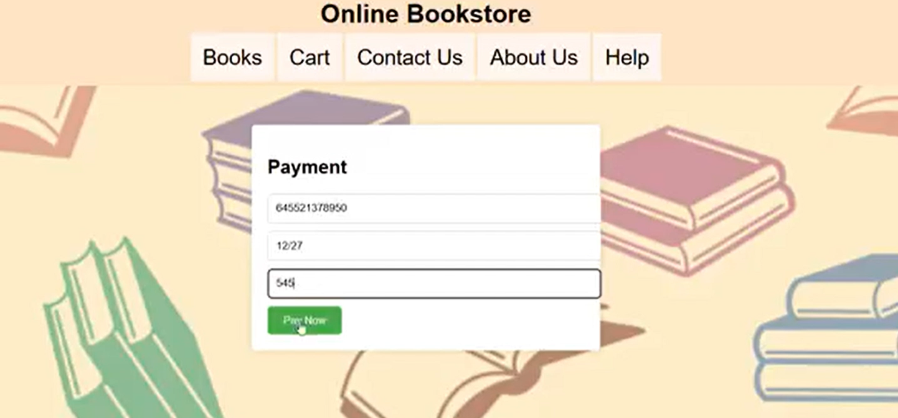
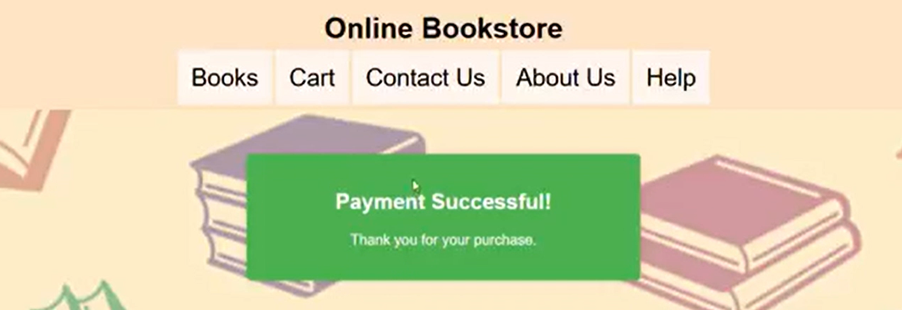
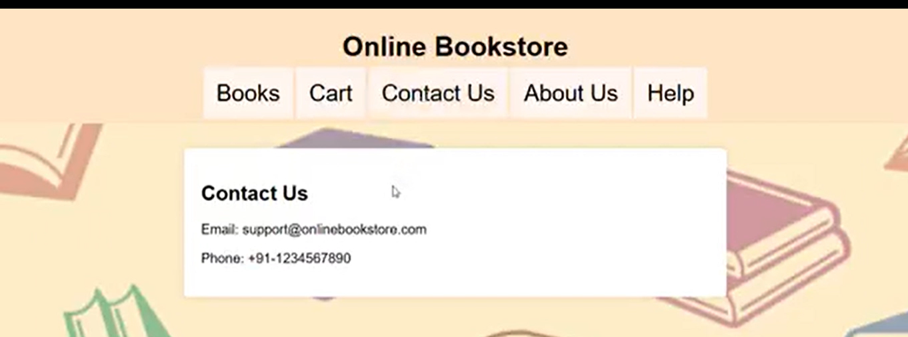
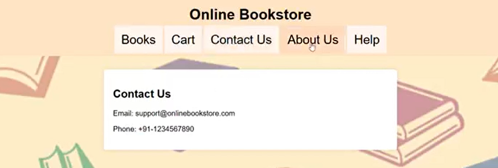
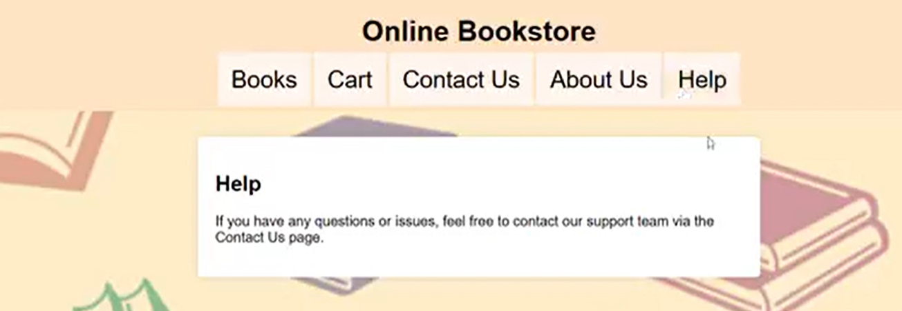
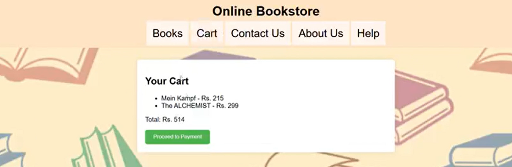
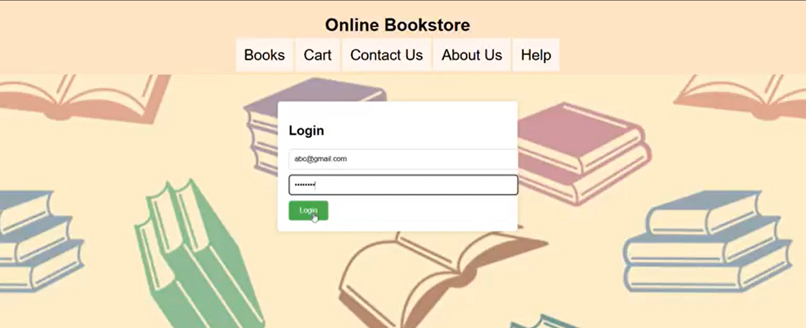
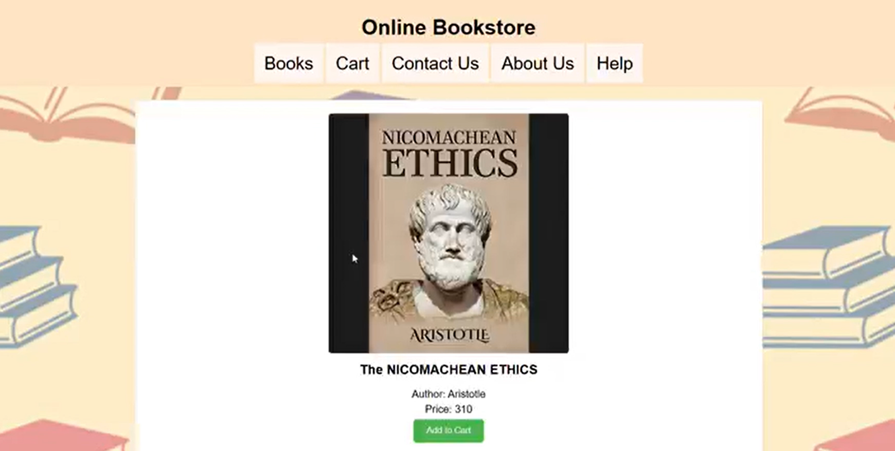

# 📚 Online BookStore

<p align="center">
  <b>A simple and user-friendly web-based Online BookStore for browsing books and managing purchases.</b>
</p>

<p align="center">
  
  
  
  
</p>

---

## 📌 About The Project

**Online BookStore** is a web-based application developed to provide users with a simple and interactive platform for browsing books and completing purchases.

The application provides a clean interface with navigation options such as **Books, Cart, Contact Us, About Us, and Help**.

Users can interact with the bookstore, manage their cart, proceed through the payment process, and receive confirmation after a successful purchase.

The project demonstrates the use of **HTML, CSS, and JavaScript** to build an interactive web application.

---

## 🎯 Objectives

- 📚 Provide an easy-to-use online bookstore interface
- 🔍 Allow users to browse available books
- 🛒 Provide shopping cart functionality
- 💳 Provide a payment interface
- ✅ Display payment confirmation
- 📞 Provide contact information
- ❓ Provide a help section for users
- 🌐 Create a responsive and user-friendly web interface

---

## ✨ Key Features

### 📚 Book Browsing

Users can browse books available through the Online BookStore interface.

### 🛒 Shopping Cart

Users can add and manage books through the shopping cart.

### 💳 Payment

The application provides a payment interface for completing a purchase.

### ✅ Payment Confirmation

After completing the payment process, the application displays a successful payment confirmation.

### 📞 Contact Us

Users can access contact information through the Contact Us section.

### ℹ️ About Us

The application provides information about the bookstore through the About Us section.

### ❓ Help

A dedicated Help section provides users with information about getting assistance.

---

## 📸 Screenshots

### 💳 Payment

<p align="center">
  
</p>

---

### ✅ Payment Successful

<p align="center">
  
</p>

---

### 📞 Contact Us

<p align="center">
  
</p>

---

### ℹ️ About Us

<p align="center">
  
</p>

---

### ❓ Help

<p align="center">
  
</p>

---

### 🛒 cart

<p align="center">
  
</p>

---

### 🚀 login

<p align="center">
  
</p>

---

### 📃 orders

<p align="center">
  
</p>

---

## 🔄 System Workflow

```text
              ┌──────────────────┐
              │       User       │
              └────────┬─────────┘
                       │
                       ▼
              ┌──────────────────┐
              │ Browse Books     │
              └────────┬─────────┘
                       │
                       ▼
              ┌──────────────────┐
              │ Add to Cart      │
              └────────┬─────────┘
                       │
                       ▼
              ┌──────────────────┐
              │ Review Cart      │
              └────────┬─────────┘
                       │
                       ▼
              ┌──────────────────┐
              │ Payment          │
              └────────┬─────────┘
                       │
                       ▼
              ┌──────────────────┐
              │ Payment Success  │
              └──────────────────┘
```
🏗️ Application Structure
```

┌───────────────────────────────┐
│            User               │
│        Web Browser             │
└───────────────┬───────────────┘
                │
                ▼
┌───────────────────────────────┐
│       Online BookStore        │
│                               │
│  • Books                      │
│  • Cart                       │
│  • Payment                    │
│  • Contact Us                 │
│  • About Us                   │
│  • Help                       │
└───────────────┬───────────────┘
                │
                ▼
┌───────────────────────────────┐
│        JavaScript             │
│     Interactive Features      │
└───────────────────────────────┘

```
🛠️ Technologies Used
Frontend
HTML5
CSS3
JavaScript
Development Tools
Visual Studio Code
Git
GitHub

📂 Project Structure

Online-BookStore/
│
├── index.html
├── style.css
├── script.js
│
├── images/
│
├── payment.png
├── payment-success.png
├── contact-us.png
├── about-us.png
├── help.png
│
└── README.md

The exact file names and folders may vary depending on the current project structure.
⚙️ Installation & Setup
1️⃣ Clone the Repository
git clone https://github.com/Aiswarya-RS/Online-BookStore.git

Navigate into the project:

cd Online-BookStore
2️⃣ Run the Application

Since this is a frontend web project, you can open:

index.html

directly in your browser.

Alternatively, you can use Visual Studio Code Live Server to run the application locally.

💻 How It Works
Step 1 – Browse Books

Users open the bookstore and browse the available books.

Step 2 – Add Books to Cart

Selected books can be added to the shopping cart.

Step 3 – Review Cart

Users can review the selected books before completing their purchase.

Step 4 – Make Payment

Users proceed to the payment interface and enter the required payment information.

Step 5 – Payment Confirmation

After successful payment, the application displays a confirmation message.

🌟 Highlights

This project demonstrates practical experience with:

Web Application Development
HTML Structure
CSS Styling
JavaScript Interactivity
Navigation Design
Shopping Cart Functionality
Payment Interface
User-Friendly UI Design
🚀 Future Enhancements
🔐 Add user registration and authentication
🗄️ Integrate a backend database
💳 Integrate a secure real payment gateway
📦 Add order history and order tracking
👤 Add user profiles
🔍 Add book search and filtering
⭐ Add book reviews and ratings
📱 Improve mobile responsiveness
🛠️ Add an administrator dashboard
☁️ Deploy the application online
🎥 Project Demo
<p align="center"> <a href="YOUR_VIDEO_LINK">  </a> </p>
👩‍💻 Author
Aiswarya R S

Computer Science Engineering Student | Java Developer | AI Enthusiast

<p align="center"> <a href="https://github.com/Aiswarya-RS">  </a> <a href="https://www.linkedin.com/in/aiswarya-r-s-a65a19374/">  </a> <a href="mailto:aiswaryaram025@gmail.com">  </a> </p>
⭐ Project Repository
<p align="center"> <a href="https://github.com/Aiswarya-RS/Online-BookStore">  </a> </p>
⚠️ Disclaimer

This project is developed for educational and academic purposes.

The payment interface shown in the project is intended as a demonstration of the application workflow and should not be considered a production payment system unless connected to a secure, verified payment gateway.
